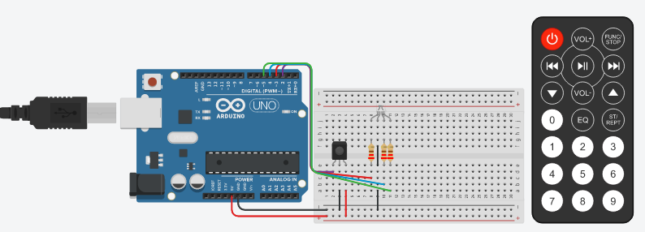

<h1 align="center"> LedColorChange </h1>

> [Tinkercad](https://www.tinkercad.com/embed/al3ih8xHdzi) - Change the color of led with remote controll

- Also, you can write by opening an Issue and also solve a current issue if possible.
- Fork this project to your Github account.
- This software is created under [MIT License](https://github.com/MuriloChianfa/LedColorChange/blob/main/LICENSE)

Click here to enter in [Tinkercad](https://www.tinkercad.com/embed/al3ih8xHdzi) hardware build

